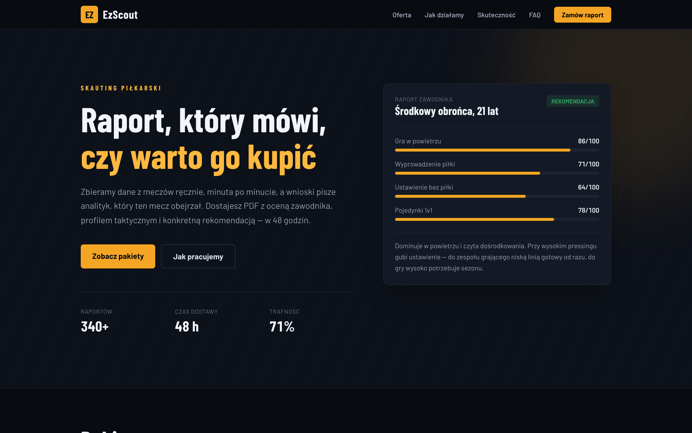
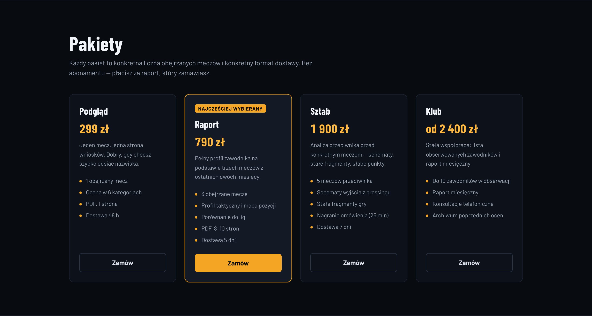
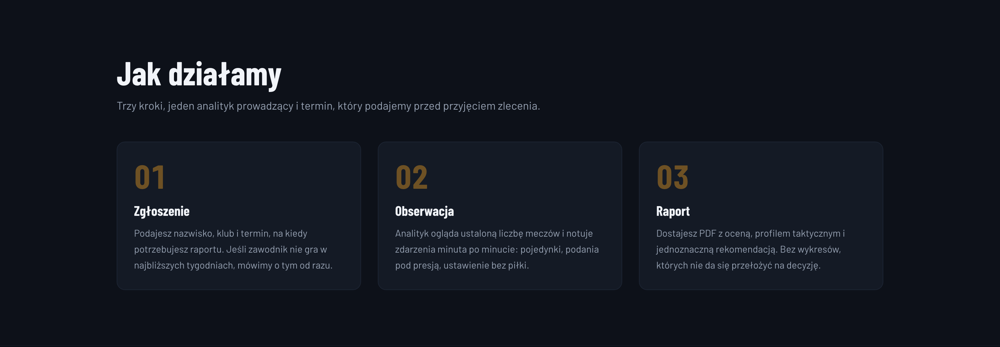
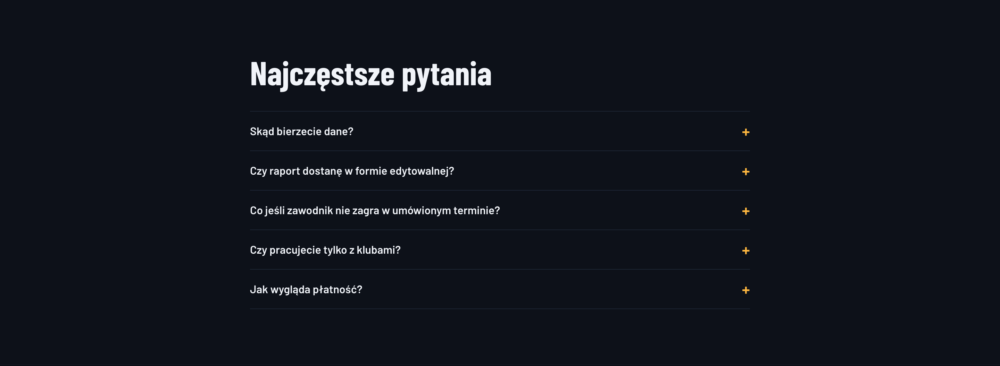

# EzScout

> ⚽ **A report that says whether he is worth buying** — scouting reports and match analysis written by an analyst who watched the match, not generated from a stats feed

**EzScout** is a product site for a football scouting service: packages, process, results and an enquiry form. The premise is deliberately narrow — data collected by hand, minute by minute, and conclusions written by the person who did the watching. Every section on the page exists to support that one claim.

There is no backend and no database. The whole site is prerendered to files and served by GitHub Pages; the only interactive parts — the mobile menu and the enquiry form — run in the browser.

[](https://github.com/dawidolko/EzScout-Platform-NextJS/actions/workflows/deploy.yml)


**Live:** [ezscout.dawidolko.pl](https://ezscout.dawidolko.pl)

---

## 🎯 Key Features

- **Four packages** — from a single-match screening to a monthly retainer, each with a stated number of matches watched and a stated delivery time.
- **A sample report card in the hero** — the visitor sees what they are buying before reading a word of the offer.
- **Honest results section** — the copy commits to publishing the misses alongside the hits, because a scouting service without misses is not credible.
- **CSS-only FAQ** — `<details>` and `<summary>`, no JavaScript, works with the script disabled.
- **Form that admits what it is** — validation runs in the browser and says plainly that nothing is sent. A demo that pretends to mail is worse than one that does not.

---

## 🖼️ Screenshots

| Hero — the offer in one screen                                                                  | Packages                                                                        |
| ------------------------------------------------------------------------------------------------ | --------------------------------------------------------------------------------- |
|                 |         |

| How the service works                                                             | Frequently asked questions                                              |
| ----------------------------------------------------------------------------------- | -------------------------------------------------------------------------- |
|  |  |

---

## 🧩 Application Layer

| Layer            | Responsibility                                                                              |
| ---------------- | ------------------------------------------------------------------------------------------- |
| `src/app`        | Routing, document metadata, fonts, JSON-LD and the page itself. One route, fully prerendered. |
| `src/components` | Header, footer, enquiry form — the only pieces that need to run in the browser.             |
| `src/components/dane.ts` | All copy: packages, process steps, figures and FAQ entries. Editing the offer never means editing markup. |
| `src/app/globals.css`    | Design tokens and base styles. Components read tokens; no component hard-codes a hex value.  |

---

## 🛠️ Technology Stack

### Frontend

| Technology   | Version | Role                                            |
| ------------ | ------- | ----------------------------------------------- |
| Next.js      | 16      | App Router with `output: 'export'`               |
| React        | 19      | Component model                                  |
| TypeScript   | 5       | Strict mode, no implicit `any`                   |
| Tailwind CSS | 4       | Utility layer on top of a token theme            |

### Infrastructure

| Technology     | Role                                             |
| -------------- | ------------------------------------------------ |
| GitHub Actions | Typecheck, build and export verification         |
| GitHub Pages   | Static hosting behind a custom domain            |

---

## 🚀 Getting Started

### Prerequisites

- Node.js 20 or newer
- npm 10 or newer

### 1. Clone the Repository

```bash
git clone https://github.com/dawidolko/EzScout-Platform-NextJS.git
cd EzScout-Platform-NextJS
```

### 2. Install Dependencies

```bash
npm install
```

### 3. Run

```bash
npm run dev        # http://localhost:3000
npm run verify     # typecheck + production build
npm run serve      # serve the exported site from out/
```

---

## 🎨 Design

Stadium at night: a very dark, slightly blue ground, amber as the single accent and condensed type borrowed from scoreboards. The pitch-line motif in the hero is a repeating CSS gradient, so it costs no network request.

Colours live as custom properties in `src/app/globals.css`. Both the palette and the type scale are defined once; a component that needs a new shade adds a token rather than a literal.

---

## ♿ Accessibility

- One `<h1>` per page, no skipped heading levels.
- Skip link as the first focusable element, `<main id="main-content">` as its target.
- `:focus-visible` rings that clear contrast on both the dark ground and the amber accent.
- Form errors bound with `aria-describedby` and `aria-invalid`; the message is text, never colour alone.
- The submitted-state message is announced through `aria-live`.
- `prefers-reduced-motion` honoured across every transition.

---

## 📁 Project Structure

```
src/
├── app/
│   ├── layout.tsx        metadata, fonts, JSON-LD, landmarks
│   ├── page.tsx          every section of the page
│   └── globals.css       design tokens and base styles
└── components/
    ├── dane.ts           packages, process, figures, FAQ
    ├── SiteHeader.tsx    sticky navigation with a mobile menu
    ├── SiteFooter.tsx
    └── FormularzKontaktu.tsx
```

---

## 📄 License

MIT — see [LICENSE](LICENSE).
